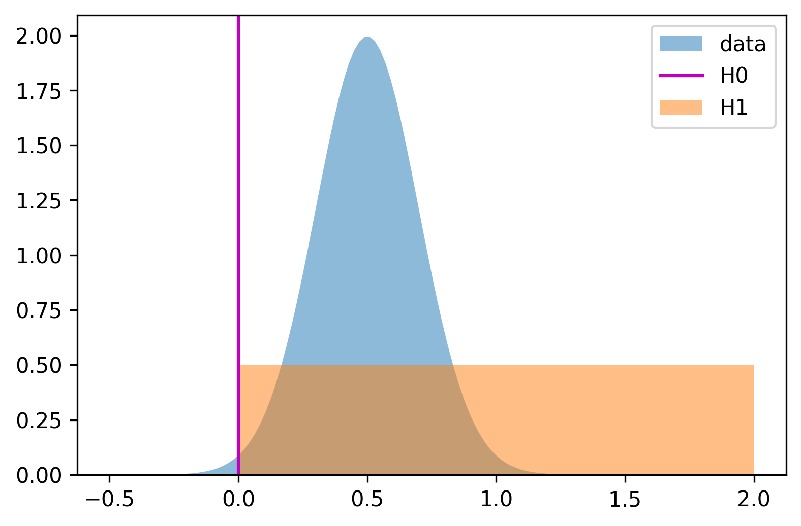

# Bayes Factor Calculation in Python



A Python module for calculating Bayes Factors indicating the strength of evidence for an alternative hypothesis H1 relative to a null hypothesis H0, using the method described in [Dienes 2014](https://doi.org/10.3389/fpsyg.2014.00781).

The data is specified by its mean and standard error of the mean.  The sampling distribution of the mean (i.e. the distribution of the sample mean around the true population mean) is assumed to be normal.  Note - this does not require the data to be normally distributed, see the Central Limit Theorem.

The null hypothesis H0 is that the mean has a specific value, `HO_value`  which is 0 by default. The alternative hypothesis H1 is specified as a distribution, which represents a prediction about the data mean under the alternative hypothesis.  The type of distribution can be specified as `'uniform'`, `'normal'`, or `'half-normal'`.   To set the parameters of the distribution the user can provide a single number, `H1_value`, which should be a reasonable estimate of the expected mean of the data under the alternative hypothesis (see Dienes 2014 for more information). This determines the parameters of the H1 distribution following recommendations in Dienes 2014 as:

- `'uniform'` :  A uniform distribution between `H0_value` and `H1_value`.
- `'normal'`  : A normal distribution with `mean = H1_value` and `SD = (H1_value - H0_value) / 2`
- `'half-normal'` : A half-normal distribution with `mode = H0` and `SD = H1_value - H0_value`

Alternatively, the parameters of the hypothesis H1 can also be specified directly, see the docstring of the `bayes_factor` function for more information.  

### Example usage:

```python
import bayes_factors as bf

# Compute Bayes factor using uniform distribution H1, specifying H1_value.
bf.bayes_factor(data_mean=0.5, data_SE=0.2, H1_distribution='uniform', H1_value=2, plot=True)

# Compute Bayes factor using normal distribution H1, specifying H1_value.
bf.bayes_factor(data_mean=0.5, data_SE=0.2, H1_distribution='normal', H1_value=2, plot=True)

# Compute Bayes factor using half-normal distribution H1, specifying H1_value.
bf.bayes_factor(data_mean=0.5, data_SE=0.2, H1_distribution='half-normal', H1_value=2, plot=True)

# Compute Bayes factor using uniform distribution H1, specifying distribution parameters directly.
bf.bayes_factor(data_mean=0.5, data_SE=0.2, H1_distribution='uniform', uniform_min=0.3, uniform_max=1.6, plot=True)

# Compute Bayes factor using normal distribution H1, specifying distribution parameters directly.
bf.bayes_factor(data_mean=0.5, data_SE=0.2, H1_distribution='normal',normal_mode=1.4, normal_SD=0.6, plot=True)

# Compute Bayes factor using half-normal distribution H1, specifying distribution parameters directly.
bf.bayes_factor(data_mean=0.5, data_SE=0.2, H1_distribution='half-normal',normal_mode=0.4, normal_SD=0.6, half="upper", plot=True)
```


© Copyright Thomas Akam 2025. Released under the GPL3 License.